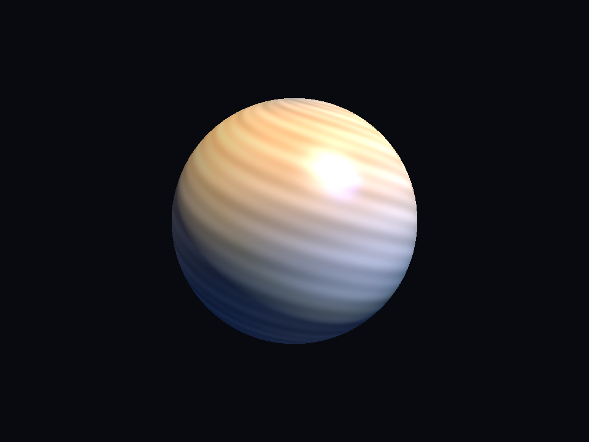
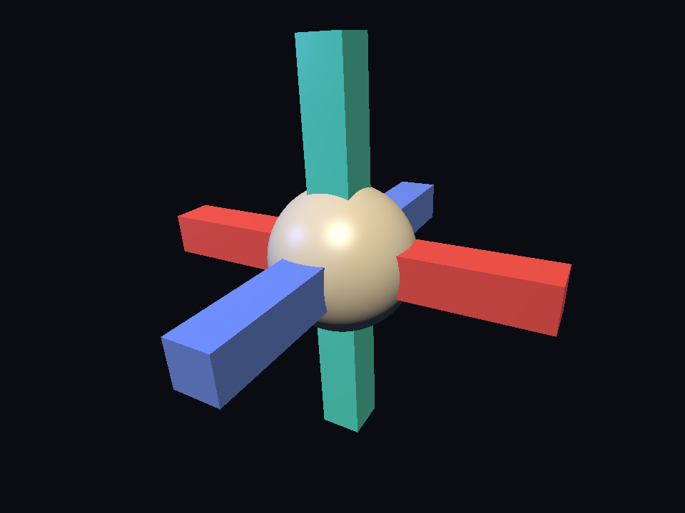
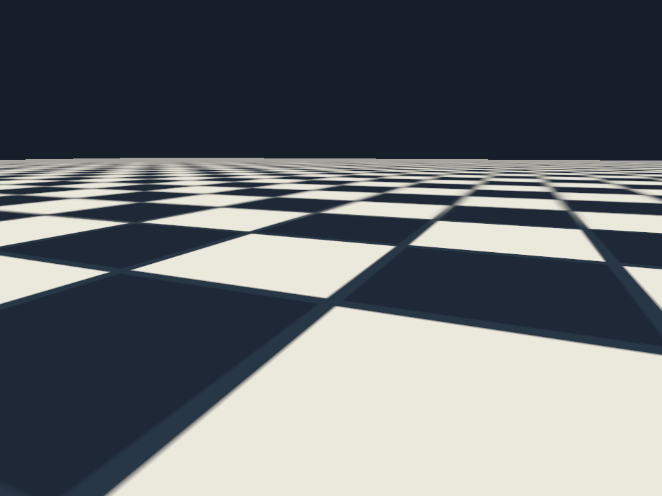
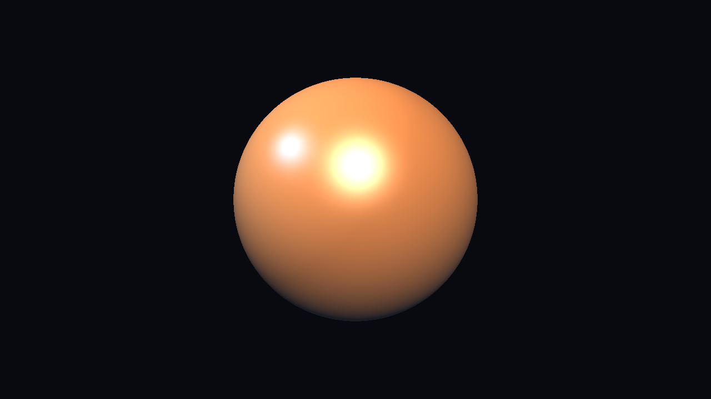

# chimy2

A 3D software renderer, from scratch, in Rust.

<p align="center">
  
</p>

## why do this again

The [original chimy](https://github.com/hwang2409/chimy) was a C+SDL2 software
renderer I wrote to force myself down to the metal — no engines, no math
libraries, no graphics API. It got the basics right (windowing, lines,
triangulation, painter's-algorithm meshes) and then stopped. It had no
z-buffer, so interpenetrating geometry looked wrong. It had no
perspective-correct interpolation, so any textured plane swam as it receded.
It had no shading model, so meshes came out flat. It had no textures. The
camera was frozen.

I wanted to climb that hill instead of walking around it. Rebuilding the
whole thing in Rust — going backwards a little bit, I know — was a chance to
do the parts I'd skipped, with the borrow checker keeping me honest about
who owns which buffer.

## the two-crate rule

The chimy rule was: I write everything. chimy2 keeps that rule, with two
concessions I'd have written from scratch too if operating systems were less
opinionated:

- `winit` — opens a window and delivers input events.
- `softbuffer` — hands me back a `&mut [u32]` for the window's pixel buffer.

Everything downstream of that `&mut [u32]` is hand-written. Vectors,
matrices, quaternions, OBJ parsing, PPM/QOI decoding, near-plane clipping,
backface culling, rasterization, tile binning, threading. Dev-only tooling
(criterion for benches) doesn't ship in the renderer, so it's allowed.

## the mini-GPU seam

The pipeline is a small trait boundary:

```text
vertex stage    VS(&Vertex, &Uniforms) -> (ClipPos, Varyings)
clip + cull     near-plane frustum clip, backface cull
raster core     barycentric scan, perspective-correct varying interpolation, z-test
fragment stage  FS(&Varyings, &Uniforms) -> Color
```

The raster core knows nothing about lighting or textures. Every material is
a shader written against this seam: `FlatColorShader`, `MeshShader`,
`TexturedShader`, `BlinnPhongShader`, `TexturedBlinnPhongShader`. The
perspective divide happens inside the core, in `1/w` space, so shaders never
see it and can't get it wrong.

## what got built

- **math**: `Vec2/3/4`, `Mat3/4`, `Quat`, with `std::ops` overloads and
  hand-computed unit tests.
- **pipeline**: the seam above, with parallel tile binning behind the same
  API — the serial path and the multi-threaded path share the per-pixel body.
- **raster**: barycentric scan, D3D-style top-left rule, perspective-correct
  varyings, OpenGL-style NDC depth.
- **clip**: near-plane clipping (fan triangulation of the visible polygon),
  backface culling.
- **mesh**: OBJ parser for positions, texture coords, normals, and
  area/angle-weighted tangent frames; smooth area-weighted normals when the
  file has none. Meshes without UVs have no tangents, so the normal-map shader
  falls back to geometric normals.
- **image**: hand-written PPM (P6) and QOI decoders + a QOI encoder for the
  dev-side asset script; selectable sRGB or linear texture decode, full
  box-filtered mip chains, nearest, bilinear, and trilinear sampling with
  repeat and clamp-to-edge wrap modes.
- **camera**: quaternion camera, orbit controller, WASD fly controller.
- **shaders**: flat, mesh, textured, blinn-phong, textured-blinn-phong, and
  tangent-space normal mapping, with linear-light lighting and sRGB
  framebuffer encoding.
- **fb / present**: framebuffer with depth, softbuffer blit, keyboard input.

Ground rule for the raster core: no clock, no randomness. Same scene in,
same pixels out. That is what makes golden-image tests possible.

## demos

Four scenes ship as bins under `src/bin/`. Each takes `--frames N` for a
clean exit and `--screenshot <path.ppm>` to render headless.

### `hero_orbit`

A slowly orbiting textured planet, lit by a warm directional key light and a
cool circling point light. Uses `TexturedBlinnPhongShader`.

<p align="center">
  
</p>

### `depth_interlock`

Three orthogonal bars pierce a central sphere. Every triangle shares one
framebuffer, and the z-buffer sorts them per pixel. A painter's-algorithm
renderer cannot draw this scene correctly — the surfaces interpenetrate, so
no back-to-front submission order works. This is exactly the hill chimy
never climbed.

<p align="center">
  
</p>

### `perspective_floor`

A checker plane receding to the horizon. Perspective-correct interpolation
keeps every tile square all the way out; an affine-only interpolator swims
the checker across the plane.

<p align="center">
  
</p>

### `stress_100k`

A 100,352-triangle sphere rendered at 1280x720 with blinn-phong lighting and
a directional plus a point light. Prints fps to stdout on the windowed
path, one line per second.

### `normalmap_demo`

A UV-mapped quad uses the procedural `normal_bump.qoi` asset. The directional
light orbits the quad. Load normal maps with `ColorSpace::Linear`.

<p align="center">
  
</p>

## running the demos

```bash
cargo run --release --bin hero_orbit
cargo run --release --bin depth_interlock
cargo run --release --bin perspective_floor
cargo run --release --bin stress_100k
cargo run --release --bin normalmap_demo
```

Add `--frames N` to any demo for a clean exit after N frames. Add
`--screenshot img/foo.ppm` to render headless and write the framebuffer as a
binary PPM. On macOS, convert with:

```bash
sips -s format png img/foo.ppm --out img/foo.png
```

Inside a windowed demo: `Esc` quits. `F` toggles between orbit and fly in
the legacy viewer bins (`lit_viewer`, `textured_viewer`, `mesh_viewer`);
fly mode uses `W A S D`, `Space`, `Shift`, and arrow keys.

## how fast is it

From PR #6, criterion baseline on an arm64 Mac17,9 (15 logical CPUs), 1280x720
blinn-phong render, `CHIMY_THREADS=15`:

| scene | serial | parallel | fps (serial / parallel) |
| --- | ---: | ---: | ---: |
| asset icosahedron (20 tris) | 4.409 ms | 0.924 ms | 226.8 / 1081.8 |
| 81,920-triangle icosahedron | 6.856 ms | 1.600 ms | 145.9 / 625.0 |
| exact 100,000-triangle scene | 8.274 ms | 1.975 ms | 120.9 / 506.4 |

The M6 architecture: 64x64 pixel tiles, a fixed pool of workers, each worker
owns a tile-local color and depth buffer for the tile it is currently
rasterizing, so writes never contend. Workers process multiple tiles in a
strided sweep — `worker_index`, `worker_index + worker_count`, and so on —
until every non-empty tile is drained. The pipeline runs the vertex, clip,
cull, and viewport stages once per triangle. It bins each resulting triangle
by its screen-space bounding box and appends the triangle's index to that
tile's list. Merging a finished tile back into the main framebuffer is a
straight `copy_from_slice`. See `src/pipeline.rs` for the tile pump and
`src/raster.rs` for the per-pixel body — the two paths share it.

Reproduce with `cargo bench --bench m6_raster -- --noplot`.

## running the tests

```bash
cargo fmt --check
cargo clippy --all-targets -- -D warnings
cargo test
cargo doc
```

Rasterizer and shader tests are golden-image: fixed scenes render headless
into a `Framebuffer` and compare against committed PPM goldens byte-for-byte.
Regenerate with `GOLDEN_REGEN=1 cargo test`; CI blocks that variable so a
regen never lands by accident. The M6 tile-binned path adds serial-vs-parallel
identity tests over every golden scene plus a nonlinear-fragment scene, run at
thread counts 2, 3, and 15 — the parallel raster is correct only if it is
pixel-identical to the serial one.

## what i learned rebuilding this

The parts chimy never touched are the parts that make a scene look like
anything at all. Depth. Perspective correctness. Shading. Textures. A real
camera. And the piece I didn't appreciate the first time: a stable, narrow
seam between the raster core and everything above it — one trait per stage,
one place where the perspective divide happens, one place where the depth
test happens. Once that's in place, "add multithreading" stops being a
scary rewrite and starts being a bin-loop around the existing per-pixel body.

The old chimy taught me why the pipeline exists. chimy2 taught me why the
seam has to be small.
